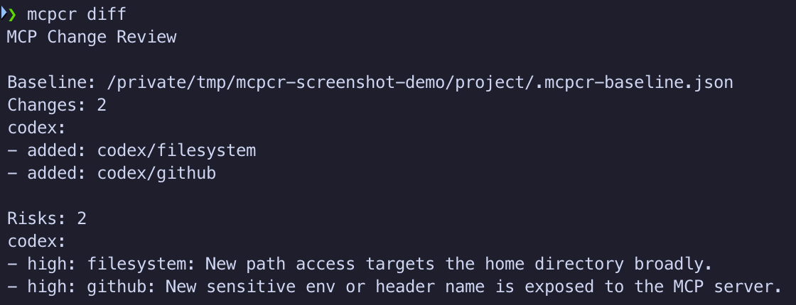

# mcp-change-review

信任新的 MCP 配置前，先看清它新增了哪些权限。

在安装、升级或共享 Claude Code 和 Codex 的 MCP 配置时，用 `mcp-change-review` 检查哪些 MCP server 发生了变化、它们能访问哪些本机资源，以及密钥、命令执行、敏感路径等明显风险。

<p>
  <a href="./package.json"></a>
  <a href="./README.zh-CN.md#支持范围"></a>
  <a href="./README.zh-CN.md#支持范围"></a>
  <a href="./LICENSE"></a>
</p>

[English](./README.md) | 简体中文

## 它能做什么

- 发现 Claude Code 和 Codex 使用的 MCP 配置。
- 创建本地基准快照，并报告 MCP server 的新增、删除和修改。
- 识别密钥、敏感路径、命令执行和 Docker `latest`。
- 支持终端输出，并可导出 Markdown 和 JSON 报告。

## 快速开始

```bash
curl -fsSL https://raw.githubusercontent.com/mctang24/mcp-change-review/main/install.sh | sh
```

## 命令

- `mcpcr list` - 列出已发现的 MCP server。
- `mcpcr status` - 检查当前目录是否已有基准快照。
- `mcpcr diff` - 对比当前 MCP 配置和基准快照；首次执行会创建 `.mcpcr-baseline.json`。
- `mcpcr accept` - 将审查后的当前状态标记为可信，并保存为新的基准快照。
- `mcpcr export md` - 生成 Markdown 报告。
- `mcpcr export json` - 生成 JSON 报告。
- `mcpcr diff --fail-on high` - 自动化场景中发现高风险变更时，以非零退出码退出。

## 示例

MCP server 会为 AI Agent 增加额外能力，例如读取本地文件或访问外部服务。

这个 Codex 示例新增了 `filesystem` 和 `github`，`mcpcr diff` 标出两项值得审查的权限变化：较宽的 home 目录访问，以及类似凭据的环境变量名称。



## 安全边界

`mcp-change-review` 只读取本机 MCP 配置，并用固定规则生成风险报告。

- **绝不保存密钥值。**
- **绝不修改 Claude Code 或 Codex 配置。**
- 只记录 env/header 名称。
- 不代理、阻断或拦截 MCP 工具调用。
- 使用固定检查规则，不依赖 LLM 判断风险。

## 支持范围

| 客户端 | 范围 |
| --- | --- |
| Claude Code | 本地、项目级和用户级 MCP 配置 |
| Codex | 用户级和受信任项目 MCP 配置 |

已基于 Claude Code `2.1.195` 和 Codex CLI `0.142.3` 验证。

## License

MIT
